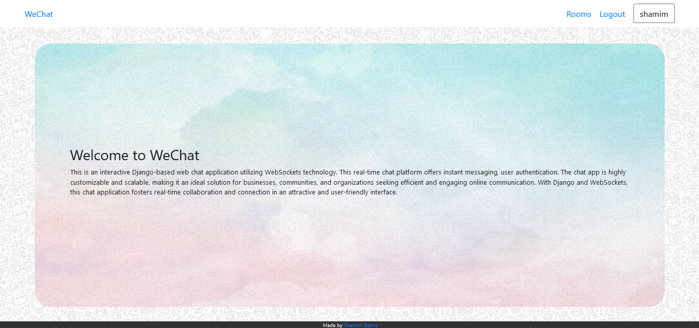
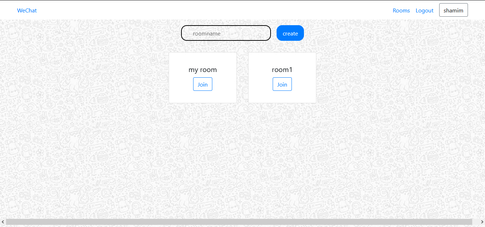
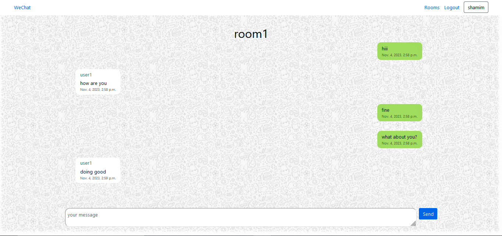

# WeChat

Welcome to WeChat

This is an interactive Django-based web chat application utilizing WebSockets technology. This real-time chat platform offers instant messaging, user authentication. The chat app is highly customizable and scalable, making it an ideal solution for businesses, communities, and organizations seeking efficient and engaging online communication. With Django and WebSockets, this chat application fosters real-time collaboration and connection in an attractive and user-friendly interface.

### Landing page

You can join a existing room or create a new rooms to join and start chatting.This app uses SOCKET.IO so that you can experience real-time chat app without having to reload the app to check if you got any new message.

### Rooms to join

Rooms will be deleted after 7 days. So that there wont be many rooms and will be easier to access the rooms.

### Chat

Chat will have the user who sent the message, date and time sent and the message.
Chats will automatically scrolled to the bottom when you get a new message.

## Distinctiveness and Complexity

### Distinctiveness

This project satisfies the distinctiveness requirement through the implementation of a real-time chat application using Django and Socket.IO which is not been teached at the CS50W - web development with python and javascript.

- **Real-Time Communication**: The core feature of this application is the real-time chat functionality, which allows users to send and receive messages instantly, creating a highly engaging and interactive experience.

- **Socket.IO Integration**: We have integrated Socket.IO into the Django framework to facilitate seamless real-time communication. This integration enables bidirectional communication between the client and server, which is a unique and advanced feature not commonly found in traditional web applications.

### Complexity

The complexity of this project can be attributed to the following factors:

- **Advanced Web Development**: The project involves complex web development concepts, including Django for the backend, real-time communication using Socket.IO, and a responsive front-end design. These technologies collectively demand a high level of technical skill and understanding.

- **Authentication and Security**: Implementing user authentication and end-to-end encryption are intricate processes that require a deep understanding of security practices. This project addresses these complexities effectively.

- **Scalability**: The project has been architected to handle scalability, which involves intricate considerations regarding performance optimization and efficient resource management.

## Files and Directories

This project contains the following files and directories:

- **/core**: This directory contains the main Django application code, including USER models, views, and templates of the core of the application.

- **core/templates**: This directory holds HTML templates used for rendering the user interface.

- **/room**: This directory contains the code for the chat rooms, including models of ROOMS and MESSAGES, views to render the list of rooms and form to create a new room, and templates of the application.

- **room/templates**: This directory holds HTML templates used for rendering the user interface.

- **room/consumers.py**: This file holds the code for the websocket consumer to have a stable connection between client and websocket.

- **room/routing.py**: This file allows r=thr routing for the websocket which cannot be accessed through urls.py

- **/requirements.txt**: A file specifying the project's dependencies.such as DJANGO, CHANNELS, DAPHNE.

## How to Run the Application

Follow these steps to run the application:

1. Ensure you have Python and pip installed on your system.
2. Clone the project repository.
3. Navigate to the project's main directory.
4. Create a virtual environment using `python -m venv venv` and activate it.
5. Install the project dependencies using `pip install -r requirements.txt`.
6. Migrate the database with `python manage.py migrate`.
7. Start the development server with `python manage.py runserver`.
8. Access the application in your web browser at `http://localhost:8000`.

Thank you for your interest in our Real-Time Chat Application! We hope it meets your expectations and demonstrates my commitment to the CS50W Web development with pthon and javascript course.